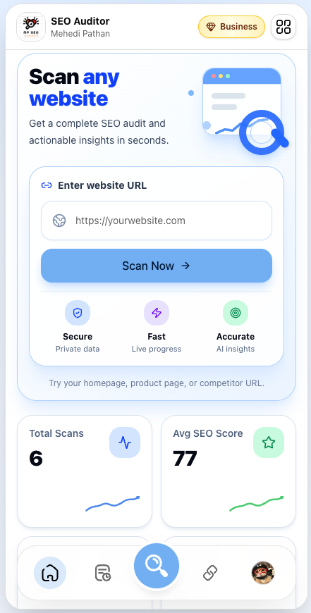
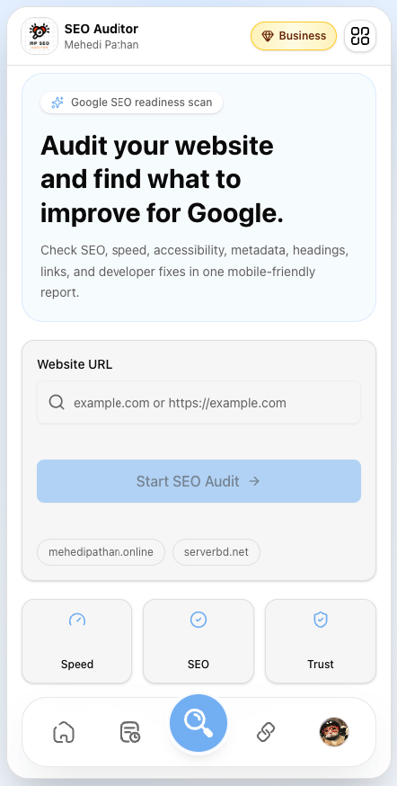
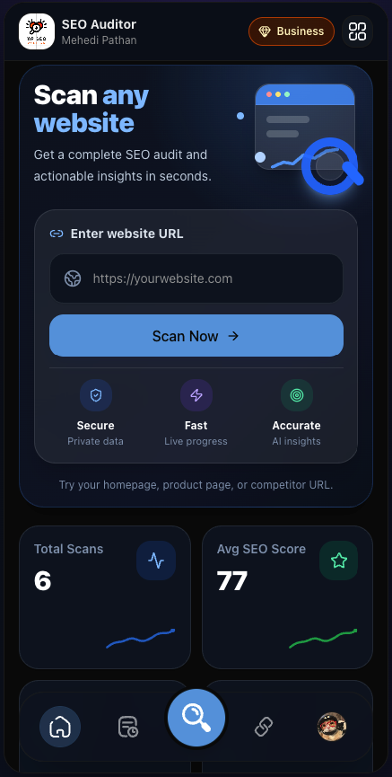
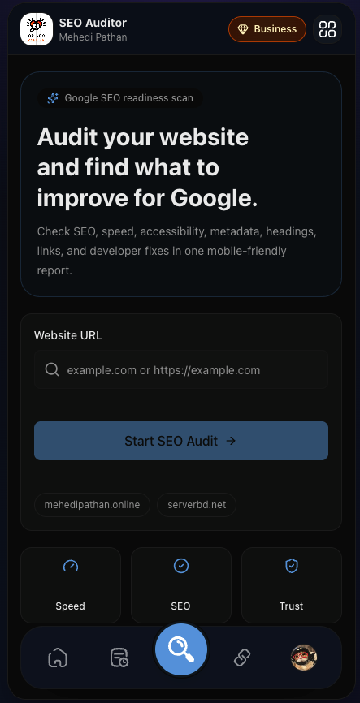

# MP SEO Auditor


MP SEO Auditor is a mobile-focused SEO audit app built to help website owners, developers, and agencies understand what is holding a site back in Google search. It scans a URL, checks technical SEO signals, pulls Google PageSpeed Insights data, generates AI-readable recommendations, and saves every audit so users can track improvement over time.

The product is designed for practical SEO work: scan a website, understand the problems, compare with competitors, export a report, and turn the findings into developer-friendly fixes.

## Preview

### APP HOME PAGE



### APP SEO AUDIT PAGE



### APP HOME PAGE - Dark Mode



### APP SEO AUDIT PAGE - Dark Mode



## What The App Does

MP SEO Auditor gives users a complete website audit with clear, human-readable recommendations. It is especially useful for business owners who want more traffic, ecommerce owners who want more sales, and developers who need a prioritized checklist of what to improve.

Core capabilities include:

- Website SEO scans for metadata, headings, content, technical checks, social tags, links, accessibility, and performance.
- Google PageSpeed Insights integration for Lighthouse performance, accessibility, SEO, best practices, core metrics, opportunities, and diagnostics.
- AI executive summaries that explain the audit in plain language.
- Audit history stored per user in Supabase.
- Trends view for tracking repeated scans of the same domain.
- Competitor comparison for side-by-side SEO improvement planning.
- Keyword research and backlink analysis pages.
- PDF report generation and cached report storage support.
- Free, Pro, and Business plan access controls.
- Manual payment flow using bKash and Nagad.
- Coupon upgrade support.
- Google authentication through Supabase Auth.
- Forgot password email template branded for MP SEO Auditor.
- Light and dark mode UI built around a mobile app-style experience.

## Tech Stack

- **Framework:** Next.js 16 with App Router
- **Language:** TypeScript
- **UI:** React 19, Tailwind CSS, shadcn-style components, Radix UI, Lucide icons, Framer Motion
- **State:** Zustand
- **Auth and Database:** Supabase Auth, Postgres, RLS policies
- **Realtime:** Supabase Realtime scan progress
- **Storage:** Supabase Storage for generated audit PDFs
- **Edge Runtime:** Supabase Edge Functions for scan, AI summary, backlink, and semantic search workflows
- **AI:** Anthropic Claude API
- **SEO Data:** Google PageSpeed Insights API
- **PDF:** jsPDF
- **Charts:** Recharts
- **Payments:** Manual bKash/Nagad upgrade flow

## Project Structure

```text
app/
  (auth)/                 Login and registration pages
  (dashboard)/            Authenticated app pages
  api/                    Next.js API routes
components/               Shared UI components
hooks/                    Client hooks, realtime and semantic search
lib/                      Scan engine, AI, PageSpeed, PDF, plan helpers
public/                   Logos, icons, screenshots, app images
scripts/                  Supabase SQL setup and utility scripts
store/                    Zustand stores
supabase/
  functions/              Supabase Edge Functions
  templates/              Supabase Auth email templates
types/                    Shared TypeScript types
```

## App Pages

| Route | Purpose |
| --- | --- |
| `/` | Public landing page with product overview, pricing, preview images, and calls to action |
| `/login` | Email/password login, Google sign-in, forgot password |
| `/register` | Account creation with email/password and Google sign-up |
| `/dashboard` | Main user dashboard with scan entry, real stats, recent scans, and plan status |
| `/scan` | Website audit page and report view |
| `/history` | Saved audit history and semantic search |
| `/trends` | Domain scan history and SEO improvement trends |
| `/backlinks` | Backlink analysis page |
| `/keywords` | Keyword research and keyword tracking page |
| `/tips` | SEO tips library with categories, search, filters, and expandable tips |
| `/profile` | User profile, profile image, account information, and plan details |
| `/upgrade` | Subscription plans, manual payment, coupon upgrade, and billing interval controls |

## Plans And Access

The app currently supports three main user-facing plans:

| Plan | Audit Limit | Best For | Access |
| --- | ---: | --- | --- |
| Free | 5 audits per month | New users testing the app | Basic audit, limited report data, scan history |
| Pro | 100 audits per month | Site owners and developers | Full reports, PDF export, trends, backlinks, keywords, compare |
| Business | Unlimited audits | Businesses and agencies | Everything in Pro plus unlimited audit usage |

Plan behavior is handled in `lib/planAccess.ts`. Subscription timestamps are supported through `plan_started_at`, `plan_expires_at`, and `billing_interval` columns so monthly and yearly packages can be managed over time.

## Getting Started

### 1. Install Dependencies

This project uses `pnpm-lock.yaml`, so `pnpm` is recommended.

```bash
pnpm install
```

### 2. Create Environment File

Copy the example environment file:

```bash
cp .env.example .env.local
```

Then fill in the required values:

```env
NEXT_PUBLIC_SUPABASE_URL=your_supabase_url
NEXT_PUBLIC_SUPABASE_ANON_KEY=your_supabase_anon_key
SUPABASE_SERVICE_KEY=your_supabase_service_role_key

ANTHROPIC_API_KEY=your_anthropic_api_key
PAGESPEED_API_KEY=your_google_pagespeed_api_key

NEXT_PUBLIC_APP_URL=https://mp-seo-auditor.netlify.app
```

Manual payment requests are handled inside the app through bKash and Nagad transaction details.

Important: never expose `SUPABASE_SERVICE_KEY` in client-side code. It must only be used in server routes, scripts, or trusted backend functions.

### 3. Run The Development Server

```bash
pnpm dev
```

Open:

```text
localhost
```

### 4. Build For Production

```bash
pnpm build
pnpm start
```

For Netlify, use:

```text
Build command: pnpm build
Publish directory: .next
Node version: 22
```

## Supabase Setup

The project uses Supabase for authentication, user profiles, audit storage, scan sessions, realtime progress, storage buckets, and semantic search.

Run the SQL files in `scripts/` inside the Supabase SQL Editor in order:

```text
001_create_audits_table.sql
002_create_profiles_table.sql
003_create_keywords_table.sql
004_fix_auth_profile_trigger.sql
005_create_manual_payments_table.sql
006_approve_manual_payment.sql
007_supabase_features_edge_storage_realtime_vector.sql
008_subscription_timestamps.sql
009_profile_avatars.sql
```

The SQL setup includes:

- `profiles` table for user plan, credits, profile image, and billing timestamps.
- `audits` table for saved scan results.
- `keywords` table for keyword tracking.
- `manual_payments` table for bKash/Nagad upgrade requests.
- `scan_sessions` table with realtime enabled.
- `audit-reports` private storage bucket for generated PDFs.
- `pgvector` extension and `match_audits` function for semantic audit search.
- RLS policies so users can only access their own data.

## Supabase Edge Functions

The app includes Supabase Edge Functions in `supabase/functions/`:

```text
scan-url
ai-summary
backlinks
generate-embedding
semantic-search
```

These functions are designed to move heavier scan and AI workflows closer to users, keep secrets off the client, and support realtime scan progress.

Typical deployment flow:

```bash
supabase functions deploy scan-url
supabase functions deploy ai-summary
supabase functions deploy backlinks
supabase functions deploy generate-embedding
supabase functions deploy semantic-search
```

Set the required Edge Function secrets in Supabase:

```bash
supabase secrets set ANTHROPIC_API_KEY=your_anthropic_api_key
supabase secrets set PAGESPEED_API_KEY=your_pagespeed_api_key
supabase secrets set SUPABASE_SERVICE_ROLE_KEY=your_service_role_key
```

## Authentication

Authentication is handled by Supabase Auth.

Supported flows:

- Email/password registration
- Email/password login
- Google sign-in
- Password recovery email

For Google Auth, configure the callback URL in the Google Cloud Console and Supabase Auth provider settings. The callback URL usually follows this pattern:

```text
https://YOUR_PROJECT_REF.supabase.co/auth/v1/callback
```

Also add your local and production URLs to Supabase Auth redirect URLs.

## Forgot Password Email Template

The custom password recovery email template lives in:

```text
supabase/templates/recovery.html
supabase/templates/recovery.subject.txt
```

To apply the template through the Supabase Management API:

```bash
SUPABASE_ACCESS_TOKEN=your_access_token pnpm supabase:email:recovery
```

The script can infer the project ref from `NEXT_PUBLIC_SUPABASE_URL`, or you can provide it manually:

```bash
SUPABASE_PROJECT_REF=your_project_ref SUPABASE_ACCESS_TOKEN=your_access_token pnpm supabase:email:recovery
```

## SEO Audit Flow

At a high level, a scan works like this:

1. User enters a website URL.
2. The app validates the URL and starts a scan session.
3. The scan engine fetches the page and parses SEO signals.
4. PageSpeed Insights returns Lighthouse data.
5. Claude generates a readable executive summary, top fixes, and quick wins.
6. The result is saved to Supabase.
7. Realtime progress updates the scanning UI.
8. PDF export can generate and store a report for future signed URL access.
9. Embeddings can be generated asynchronously for semantic history search.

## Payments

The upgrade page supports manual payment submission through:

- bKash
- Nagad

Payment number:

```text
+8801622839616
```

Users submit their sender number and transaction ID. Admins can review and approve the payment through the database flow provided in the SQL scripts.

## Semantic Search

History search supports natural-language queries such as:

- `sites with slow performance`
- `missing meta descriptions`
- `worst SEO scores`
- `audits with backlink problems`

Semantic search uses `pgvector` and the `match_audits` SQL function. If semantic results are unavailable, the app can fall back to regular text search.

## Development Notes

- Keep server-only secrets in API routes, Supabase Edge Functions, or backend scripts.
- Keep user-facing UI responsive inside the mobile app shell.
- Do not replace the brand logo with a user avatar. User images belong in profile/avatar positions only.
- Run database scripts in order when creating a fresh Supabase project.
- Use the existing plan helpers before adding new plan-gated features.
- Use the existing PDF export helper before adding new report formats.

## Useful Scripts

```bash
pnpm dev
pnpm build
pnpm start
pnpm lint
pnpm supabase:email:recovery
```

## Deployment Checklist

Before deploying, confirm:

- Environment variables are configured.
- Supabase SQL scripts have been run.
- RLS policies are enabled and tested.
- Supabase Auth redirect URLs are correct.
- Google Auth provider is configured.
- Edge Function secrets are set.
- Edge Functions are deployed.
- PageSpeed API key is valid.
- Anthropic API key is valid.
- Storage bucket `audit-reports` exists and is private.
- Password recovery template has been applied.
- Production URL is set in `NEXT_PUBLIC_APP_URL`.

## Credits

Designed and developed by [Mehedi Pathan](https://mehedipathan.online).

MP SEO Auditor is built to make SEO clearer for real business owners and easier for developers to act on.
